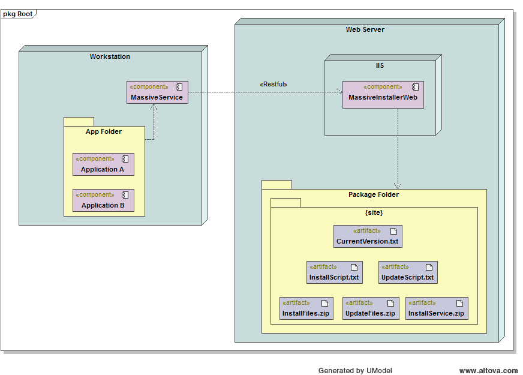

Masive Installer
================

## Overview

*Massive Installer* is a  system to install one o more applications into several workstations wich must have same features installed, as could be a Contact Center. *Massive Installer* uses Restfull to install and update the applications which have  their install files, or update, into the web server where has been *Massive Installer Web* installed.

*Massive Installer* consist into tow projects:

+ *Massive Installer Web*.
+ *Massive Installer Service*.

*Massive Installer* is able to have many set of installer package, or update, and everyone of them are isolate from other each other. With this feature it is possible has several kind of configurations into the same domain. Each installer package are identified by a code which is called **Site Code**.

*Massive Installer* has a restriction: Each workstation which has *Massive Installer Service* can handle just one *Site Code*, which means that the workstation will work for that unique *Business Rule*, into the organization, and if it is necessary change it (*Site*), the *Massive Installer Service* must be reinstalled.

### Architecture



### Requirements

+ IIS 6 or latter.
+ .Net Framework 4.5.
+ VS 2015 Community Edition or latter.
+ ASP.NET Web API.
+ Windows Server 2012 x64, for Web Server.

## Massive Installer Web

The Application Web can be used by Restfull, that it's meaning that it use *HTTP Request/Response* to acces them. The use the RESTful you have to kwon its format:


```batch
http://{HOST:PORT}/api/Installer/GET/{Method}?site={Site Code}&Type={Type Code}
```

Donde:

| Macro | Description |
|-|-|
| **{HOST:PORT}** | Host and Port where *Massive Installer Web* is attending requests. |
| **{Method}** | It the name of method to use, it has three options: **CurrentVersion**, **Files** and **Script** |
| **{Site Code}** | It is the site's code from where the request ask for information, i.e.: *CCD*, *EscCom*, etc. Usually it is a code defined by the company and business rules. |
| **{Type Code}** | It is a code  which set the type of package or scripts to be used into the Install/Update action. There are three differents options: **B**, download the package of *Masssive Installer Service*;  **I**, download the package or script to execute a new installation. **U**, download the package or script to execute an update. |

### Configurations

Massive Installer Web has a only dinamic parameter wich indicates where the main *Site Container Folder* is founded. This parameter is called **Root_Path** and its into the element `<appSettings>`.

```xml

  <appSettings>
    <add key="Root_Path" value="C:\masiveinstaller\installer\"/>
  </appSettings>

```

> **Importante**: The value of this propertie must end with slash (**\**).

### Site Folder

Each *Site Folder* must have its name same as its *Site Code*, for example: if the *Massive Installer Web* has two site configured, *CCD* and *EsCom*, then folder configured as **Root_Path** must have two folder called *CCD* and *EsCom*.

Each *Site Folder* will contain its own *Package Files* to be used for the RESTful methods, these files are:

+ **InstallerService.zip**. *Must have*.
+ **CurrentVersion.txt**. *Must have*.
+ **InstallScript.txt**. *Must have*.
+ **InstallFiles.zip**. *Must have*.
+ **UpdateScript.txt**. *Optional*.
+ **UpdateFiles.zip**. *Optional*.

For example:

```cmd

c:\MassiveInstaller\
  |
   - CCD
  |   |
  |    - InstallerService.zip
  |    - CurrentVersion.txt
  |    - InstallScript.txt
  |    - etc...
  |
   - EsCom
      |
      - InstallerService.zip
      - CurrentVersion.txt
      - InstallScript.txt
      - etc...

```


#### *InstallerService.zip* File

*InstallerService.zip* has all the files to install the windows service that will performance the Installation or Upgrade. This is a ZIP file its installation must be manually.

#### *CurrentVersion.txt* File

This is a Text File which has the version to install. Its contest must be a single line with the current version to be installed, i.e:

```sql
1.3.4
```
> **Important:** The text which represents the version must not have white spaces or tabs and it must be just one line. Otherwise it will affect the *MACROS*.

#### *InstallScript.txt* File

This file has all the command that *Massive Installer Service* will execute to make a new installation.

#### *InstallFiles.zip* File

This ZIP file has all the files that *Massive Installer Service* need to  handle according to *InstallScript*.

#### *UpdateScript.txt* File

This file has all the command that *Massive Installer Service* will execute to make an update.

#### *UpdateFiles.zip* File

This ZIP file has all the files that *Massive Installer Service* need to handle according to *UpdateScript*.

### Massive Installer Web Method

This section list the differents metods and its names

| Method | Site Code (**site**) | Type Code (**Type**) | Response |
| - | - | - | - |
| CurrentVersion | {Site Code} | - | CurrentVersion.txt |
| Script | {Site Code} | **I** | InstallFiles.txt |
| Files | {Site Code} | **I** | InstallFiles.zip |
| Script | {Site Code} | **U** | UpdateFiles.txt |∫
| Files | {Site Code} | **U** | UpdateFiles.zip |
| Files | {Site Code} | **B** | InstallerService.zip |

> In the case of *File* method with *Site Code* **B**, the name of file downloaded will be **Package.zip**.

## Massive Installer Service

**MassiveInstaller** is a *Windows Service* which does:

1. Chech the current version, configured into *Massive Installer Web*, vs the local version to check the action to execute: a new Installation, Update or do nothing (it has the current version).

2. According with the action, Installation or Update, it downloads the Script and Zip files, using  *Massive Installer Web*.

3. With the Script and Zip Files downloaded the *Massive Installer Service* will execute the unzip the Zip Files and handle them as the script indicate.

> If the *Massive Installer Service* determined that there is no action to execute, it will wait for 10 minutes repeat the step 1.

> If the Version has changed the *Massive Installer Service* will install, if there is no local version installer, or update, if there is a different version in *Massive Installer Web*, the version that is configured in *Massive Installer Web*.s

## Requirements

+ Windows 7 or latter.
+ .Net Framework 4.5.
+ Access by network to *Massive Installer Web*.
+ A windows user account to:
  + Handle files.
  + Create folders.
  + Create and Change registry fields.
  + Run console commands as can be System Console commands, i.e: `SC delete MyService`


## Install *Massive Installer Service*

This process must be executed by each computer which is part of the group the *Site* and its process is manually. Once the *Massive Installer Service* is installed the automatic process will be performed.


**1.** Use a browser to dDownload the Package for install the *Massive Installer Service*, using the method **File** of *Massive Installer Web*, set the correct *Site Code* to download and use the *Type Code* **B**. The url must have the next format:

```cmd
http://{HOST:PORT}/api/Installer/GET/Files?site={Site Code}&Type=B
```


**2.** Unzip the **Package.Zip** file into the path:

```cmd
c:\MassiveInstaller\MassiveInstallerService
```

> You can change this path but if you do it you must chage all the paths in this guide.s

**3.** Using a console terminal, with administrator privilege, to install *Massive Installer Service* with the next command:

```cmd
SC create MassiveInstallerService binPath="c:\MassiveInstaller\MassiveInstallerService\MassiveInstaller.exe {Site Code} {HOST:PORT}" DisplayName=">Massive Installer" start=auto
```

Where:
+ **{Site Code}** is the code that will be used by the computer along the life of service of *Massive Installer Service*.
* **{HOST:PORT}** is the address conformed with host and port that *Massive Installer Service* uses to create the URL and access to the RESTful interface of *Massive Installer Web*.

> **Important**: If you need change this configuration you must reinstall the service with the new parameters.

**4.** Using a console terminal, with administrator privilege, start *Massive Installer Service* with the next command:

```cmd
SC start MassiveInstallerService
```

>**Importante**: Once the service has been started it will be take 10 second to start to check the versions. After the first review, the service will start an infinite cycle in which every 10 minutes will carry out a new revision.


## Rules for Script

The *Script File* is used for *InstallFiles.txt* and *UpdateFiles.txt*. The script contains commands to handle ZIP files, create Shortcuts, handle directory and execute terminal commands. Each Script uses a command per line, each line has the follow format:

   **Command** *{-Space-}* **String of Arguments**

There are two differents kinds of **Commands**:

+ **Terminal Console**: This kind of commands are characterized by be a command which can be execute in a terminal command of Windows. This kind of must begin with the prefix **$** followed by the termianl console command, i.e: `$SC start PaletteService`.
+ **Exclusive Commands**: *Exclusive Commands* are those commands that just can be execute by *Massive Installer Service*, So it can be executed in a Terminal Console. Unlike *Terminal Console* these command don't begin with a prefix, it means that the line which has a *Exclusive Command* must begin whit the command.

Each command can uses two *MACROs* which will be replaced by Current Version or New Version. This macros are:
+ `{LST_VER}`: Current Version, stored into the workstation.
+	`{NEW_VER}`: New Version, installed into the file **CurrentVersion.txt**, from Web Host.

And they can be used as:

```cmd
$COPY c:\dir_{LST_VER}\file.zip c:\Backup\file_Bckp_{NEW_VER}.zip
```

In this example the *MACROS* will be replaced with their corresponding values.


Scripts allows comment and they must begin with a character  '**#**'. For example

```cmd
# This is a comment for a command ZIP
ZIP c:\file.zip d:\destiny
```

## Exclusive Commands

| Pourpose | **Command** | **Arguments Line** |
|-|-|-|
| Create a Directory | *MKDIR* | **"[drive:]\[path]\DirToCreate"** |
| Delete a Directory | *RMDIR* | **[drive:]\[path]\DirToDelete** |
| Create a ZIP file from directoy | *ZIP* | **"[drive:][path]SurceDir" "[drive:][path]DesFilename"**  |
| Unzip a ZIP file to a directory | *UNZIP* | **"[drive:][path]SurceFilename" "[drive:][path]DesFilename"**  |
| Create a ShortCut| *SHORTCUT* | **"[shortcutName]" "[shortcutPath]" "[targetFileLocation]" "[pathIcon]"**  |

> Important: Be careful of use double quote (**"**) into the arguments where is specified.

> In some case you can chage the secction [drive:] with the relative path (**.\\**) to indicate that the root path is the *Masssive Installer Service* path, where it is running.


## Samples of Scripts


This sample has the script for a new installation (*InstallScript.txt*) and its steps are:

1. Create the destiny folder.
2. Unzip the contest of downloaded package, called *Package.zip* which was downloaded by *Masssive Installer Web* interfaz when *Massive Installer Service* determined that the actio to execute is a new installation.
3. Create a Windows Service called *PaletteService*.
4. Execute a batch file called *InstallTestWrapper-NT.bat*.
5. Start the new Windows Service *PaletteService*.
6. Create a ShortCut.

```cmd
MKDIR c:\aspect\Palette
UNZIP .\TEMP\Package.zip c:\aspect\Palette
$SC create PaletteService binPath="c:\aspect\palette\bin\service\PaletteService.exe" DisplayName="ISAT Paleta Service V{NEW_VER}" start=auto
$c:\aspect\palette\bin\service_jtapi\jPaletaBVVA\bin\InstallTestWrapper-NT.bat
$SC start PaletteService
SHORTCUT "Palette Desktop.lnk" "C:\Users\Administrator\Desktop" "C:\aspect\Palette\bin\desktop\PaletteDesktop.exe" "C:\aspect\Palette\bin\desktop\img\favicon.ico"
```

> The steps 3 to 5 use *Terminal Console Commands* meanwhile steps 1 and 6 use *Exclusive Commands*

> The command 3 uses the *MACRO* to get the value for New Version.
